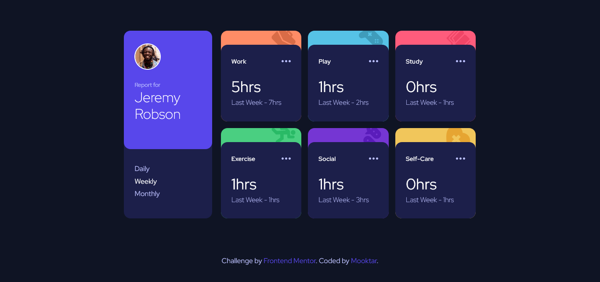

# Frontend Mentor - Time tracking dashboard solution

This is a solution to the [Time tracking dashboard challenge on Frontend Mentor](https://www.frontendmentor.io/challenges/time-tracking-dashboard-UIQ7167Jw). Frontend Mentor challenges help me improve my coding skills by building realistic projects. 

## Table of contents

- [Overview](#overview)
  - [The challenge](#the-challenge)
  - [Screenshot](#screenshot)
  - [Links](#links)
- [My process](#my-process)
  - [Built with](#built-with)
  - [What I learned](#what-i-learned)
- [Author](#author)
- [Acknowledgments](#acknowledgments)

**Note: Delete this note and update the table of contents based on what sections you keep.**


## Overview

### The challenge

Users should be able to:

- View the optimal layout for the site depending on their device's screen size
- See hover states for all interactive elements on the page
- Switch between viewing Daily, Weekly, and Monthly stats

### Screenshot



### Links

- Solution URL: [Time Tracking Dashboard](https://github.com/hoytima/time-traching.git)
- Live Site URL: [Time Tracking Dashboard - Vercel](https://time-tracking-dashboard-delta.vercel.app/)


## My process

### Built with

- Semantic HTML5 markup
- CSS custom properties
- Sass langage
- Flexbox
- CSS Grid
- Mobile-first workflow
- Fetch javascript api

### What I learned

Briefly, I have use the same notions of HTML5, Sass and JavaScript globaly.

Review some Sass basics notions ass

```css
@mixins name($var) {
  // style here
}
```

Documenting function

```js
/**
 * Display a card item for each getting data
 * @param {object} data Object
 * @param {string} type String
 */
```


## Author

- Website - [Mooktar](https://www.mooktar.github.io)
- Frontend Mentor - [@mooktar](https://www.frontendmentor.io/profile/yourusername)
- Twitter - [@mooktar_dev](https://www.twitter.com/mooktar)


## Acknowledgments

Feel free to use this projet but your MUST KEEP the CREDIT to the author (@mooktar_dev)
